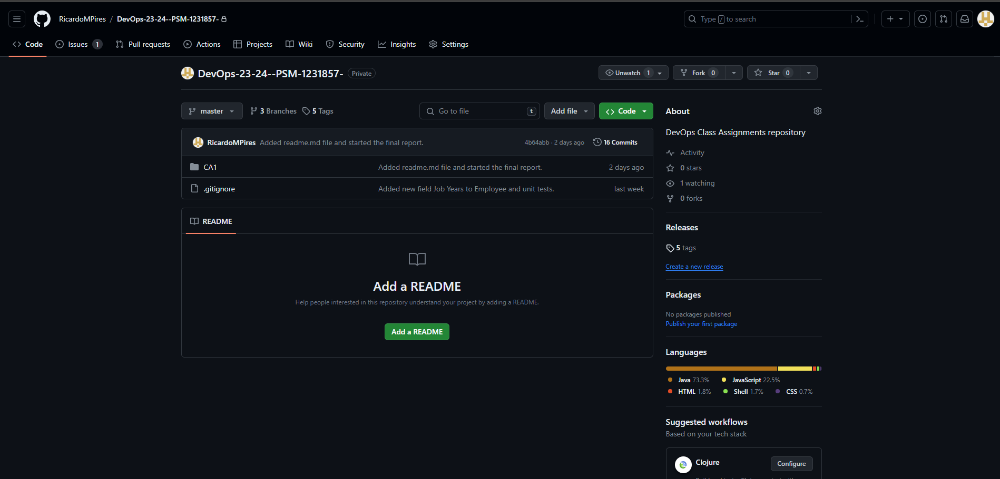
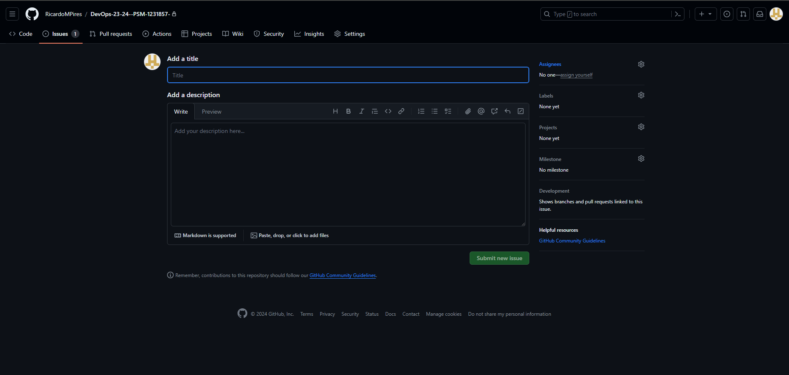
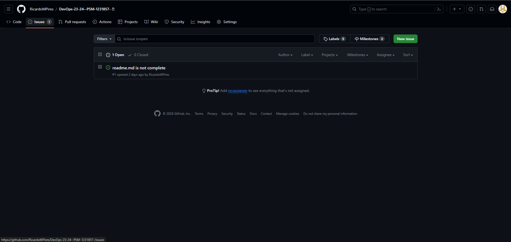

# Class Assignment 1

## Introduction

The goal of this class assignment was to use or personal repositories and use a basic spring application to introduce new features and introduce the concept of branches and merging. Although the features are simple, the goal is to understand the process of managing a repository, including its commits, creating a branch, adding new features and merging the branch back into the main branch.
The final result of the assignment can be found [here](https://github.com/RicardoMPires/DevOps-23-24--PSM-1231857-).

## Table of Contents

1. [Getting Started](#Getting-started)
2. [Implementing Changes](#Implementing-Changes)
   - [Part 1: Adding the job years field](#Part-1-Adding-the-job-years-field)
   - [Part 2: Adding the email field](#Part-2-Adding-the-email-field)
   - [Part 3: Adding the fix for invalid email addresses](#Part-3-Adding-the-fix-for-invalid-email-addresses)
3. [Issues](#Issues)
4. [Alternative to Git: Mercurial](#Alternative-to-Git-Mercurial)
   - [Setting up a repository in Mercurial](#Setting-up-a-repository-in-Mercurial)
   - [Useful commands for Mercurial](#Useful-commands-for-Mercurial)
5. [Final Remarks](#Final-Remarks)

## Getting Started

The first step is to clone [this repository](https://github.com/spring-guides/tut-react-and-spring-data-rest) to your local machine as it will serve as the basis for the task. The only module needed for this assignment  is _basic_, the other ones are not required and therefore can be deleted.
The rest of the assignment can be done by opening a bash terminal and running the following commands:

1. Navigate to the project directory (assuming the Tutorial React.js and Spring Data REST Application is already locally available):
   ```bash
   cd path/to/TutorialReactSpringDataREST
   ```
- command cd changes the current directory

2. Copy the application into a new CA1 folder:
   ```bash
   cp -r . ../CA1
   cd ../CA1
   ```
    - command cp copies the directories and files stated ('.', the current directory), the '-r' notation says it will be copied recursively (all its contents) and '../CA1' is the destination folder

3. Initialize the Git repository (if not already a Git repository):
   ```bash
   git init
   ```
    - adds a ".git" directory to the current directory (the added directory contains alal the information required for the repository work process)

4. Add all files to the staging area:
   ```bash
   git add .
   ```
    - before being ready to be commited and then pushed to the remote repository, changes must be added to a staging area, covered by this command. The "." notation indicates that ALL the unstaged files in the repository directory should be staged.

5. Commit the added files:
   ```bash
   git commit -m "Initial commit with the Tutorial application"
   ```
    - creates a new commit, containing the current contents of the index (the staged changes to the files in the repository) and the given log message (after "-m") describing the changes.

6. Push the commit to the remote repository:
   ```bash
   git remote add origin <repository-URL>
   git push -u origin master
   ```
    - the first step is only necessary if the local repository is not yet linked to the remote one, as it is its function.
    - The second step  uploads local repository content to the remote repository location.

7. Add a tag to the commit:
   ```bash
   git tag -a v1.1.0
   git push --tags v1.1.0
   ```
    - the first step creates a new tag, with the name "v1.0" and the message "First version of the application"
    - the second step uploads the tag to the remote repository

### Implementing Changes
#### Part 1: Adding the job years field

This first section is done on the main branch, and the goal is to add a new field to the application, which will be the number of years the user has been working in the current job. The steps to do so are:

1. Add the new field to the _Employee_ class:
   ```java
   private int jobYears;
   ```
   
2. Add the new field to the _Employee_ class constructor:
   ```java
    public Employee(String name, String role, int jobYears) {
         this.name = name;
         this.role = role;
         this.jobYears = jobYears;
    }
    ```
   
3. Add validations to the _Employee_ class constructor so that the parameters are always valid:
   ```java
   public Employee(String firstName, String lastName, String description, int jobYears) throws InstantiationException {
		 if(firstName == null || lastName == null || description == null || email == null || jobYears < 0 || firstName.isEmpty() || lastName.isEmpty() || description.isEmpty() || email.isEmpty())
			throw new InstantiationException("Please enter a valid first name, last name, description and job years.");
		 this.firstName = firstName;
		 this.lastName = lastName;
		 this.description = description;
		 this.jobYears = jobYears;
	}
   ```
4. Add the new field to the _Employee_ class getters and setters:
   ```java
   public int getJobYears() {
       return jobYears;
   }

   public void setJobYears(int jobYears) {
       this.jobYears = jobYears;
   }
   ```
5. Add the new field to the _Employee_ class toString method:
   ```java
   return "Employee{" + "id=" + this.id + ", name='" + this.name + '\'' + ", role='" + this.role + '\'' + ", jobYears=" + this.jobYears + '}';
   ```
   
6. Add the new field to the equals method:
    ```java
    public boolean equals(Object o) {
		 if (this == o) return true;
		 if (o == null || getClass() != o.getClass()) return false;
		 Employee employee = (Employee) o;
		 return Objects.equals(id, employee.id) &&
			Objects.equals(firstName, employee.firstName) &&
			Objects.equals(lastName, employee.lastName) &&
			Objects.equals(description, employee.description) &&
			Objects.equals(jobYears, employee.jobYears)
	}
    ```
7. Add the new field to the _Employee_ class hashCode method:
    ```java
    public int hashCode() {
		 return Objects.hash(id, firstName, lastName, description, jobYears);
	}
    ```
   
8. Create an EmployeeTest class and add unit tests for the new field, ensuring that all methods and validations are covered:
   ```java
   class EmployeeTest {

    @Test
    void createEmployee_Success() throws InstantiationException {
        String firstName = "Frodo";
        String lastName = "Baggins";
        String description = "ring bearer";
        int jobYears = 1;
        Employee employee = new Employee(firstName, lastName, description, jobYears, "frodo.baggins@shire.com");
        assertEquals(firstName, employee.getFirstName());
        assertEquals(lastName, employee.getLastName());
        assertEquals(description, employee.getDescription());
        assertEquals(String.valueOf(jobYears), employee.getJobYears());
    }

    @Test
    void createEmployee_InvalidFirstName(){
        String firstName = "";
        String lastName = "Baggins";
        String description = "ring bearer";
        int jobYears = 1;
        assertThrows(InstantiationException.class, () -> new Employee(firstName, lastName, description, jobYears,"frodo.baggins@shire.com"));
    }

    @Test
    void createEmployee_InvalidLastName(){
        String firstName = "Frodo";
        String lastName = "";
        String description = "ring bearer";
        int jobYears = 1;
        assertThrows(InstantiationException.class, () -> new Employee(firstName, lastName, description, jobYears,"frodo.baggins@shire.com"));
    }

    @Test
    void createEmployee_InvalidDescription(){
        String firstName = "Frodo";
        String lastName = "Baggins";
        String description = "";
        int jobYears = 1;
        assertThrows(InstantiationException.class, () -> new Employee(firstName, lastName, description, jobYears,"frodo.baggins@shire.com"));
    }

    @Test
    void createEmployee_InvalidJobYears(){
        String firstName = "Frodo";
        String lastName = "Baggins";
        String description = "ring bearer";
        int jobYears = -1;
        assertThrows(InstantiationException.class, () -> new Employee(firstName, lastName, description, jobYears,"frodo.baggins@shire.com"));
    }

    @Test
    void createEmployee_NullFirstName(){
        String firstName = null;
        String lastName = "Baggins";
        String description = "ring bearer";
        int jobYears = 0;
        assertThrows(InstantiationException.class, () -> new Employee(firstName, lastName, description, jobYears,"frodo.baggins@shire.com"));
    }

    @Test
    void createEmployee_NullLastName(){
        String firstName = "Frodo";
        String lastName = null;
        String description = "ring bearer";
        int jobYears = 0;
        assertThrows(InstantiationException.class, () -> new Employee(firstName, lastName, description, jobYears,"frodo.baggins@shire.com"));

    }

    @Test
    void createEmployee_NullDescription(){
        String firstName = "Frodo";
        String lastName = "Baggins";
        String description = null;
        int jobYears = 0;
        assertThrows(InstantiationException.class, () -> new Employee(firstName, lastName, description, jobYears,"frodo.baggins@shire.com"));
    }

    @Test
    void createEmployee_ZeroJobYears() throws InstantiationException {
        String firstName = "Frodo";
        String lastName = "Baggins";
        String description = "ring bearer";
        int jobYears = 0;
        Employee employee = new Employee(firstName, lastName, description, jobYears,"frodo.baggins@shire.com");
        assertEquals(firstName, employee.getFirstName());
        assertEquals(lastName, employee.getLastName());
        assertEquals(description, employee.getDescription());
        assertEquals(String.valueOf(jobYears), employee.getJobYears());
    }
}


9. Add the new field to the render methods in the app.js Javascript file:
```javascript
   class EmployeeList extends React.Component{
	render() {
		const employees = this.props.employees.map(employee =>
			<Employee key={employee._links.self.href} employee={employee}/>
		);
		return (
			<table>
				<tbody>
					<tr>
						<th>First Name</th>
						<th>Last Name</th>
						<th>Description</th>
						<th>Job Years</th>
					</tr>
					{employees}
				</tbody>
			</table>
		)
	}
}
````
```javascript
class Employee extends React.Component{
	render() {
		return (
			<tr>
				<td>{this.props.employee.firstName}</td>
				<td>{this.props.employee.lastName}</td>
				<td>{this.props.employee.description}</td>
				<td>{this.props.employee.jobYears}</td>
			</tr>
		)
	}
}
````
10. Add the new field to the run method in the DatabaseLoader class (you can also add new entries):
```java
   	public void run(String... strings) throws Exception { // <4>
    this.repository.save(new Employee("Frodo", "Baggins", "ring bearer", 2));
    this.repository.save(new Employee("Bilbo", "Baggins", "burglar", 35));
    this.repository.save(new Employee("Gandalf", "the Grey", "wizard", 10000));
}
```
                
11. Open a bash in the basic folder of the app and run the following command:
```bash
./mvnw spring-boot:run
```
12. Open a browser and navigate to [http://localhost:8080/employees](http://localhost:8080/employees) to see the changes. It should look like this:

13. Commit the changes to the main branch:
```bash
git commit -m "Added the job years field to the application"
```
14. Push the changes to the remote repository:
```bash
git push
```
15. Add a tag to the commit:
```bash
git tag -a v1.2.0
git push --tags v1.2.0
```
16. Add a tag to mark the finish of this first part of the assignment:
```bash
git tag -a ca1-part1
git push --tags ca1-part1
```

#### Part 2: Adding the email field

For this part of the assignment, a new branch will be created, and the changes will be made there. The goal is to add a new field to the application, which will be the email of the employee. The steps to do so are:

1. Create a new branch:
```bash
git branch email-field
```
2. Switch to the new branch:
```bash
git checkout email-field
```
3. Push the  new branch to the remote repository:
```bash
git push -u origin email-field
```
4. Add the new field to the _Employee_ class:
```java
private String email;
```
5. Add the new field to the _Employee_ class constructor:
```java
public Employee(String name, String role, int jobYears, String email) {
    this.name = name;
    this.role = role;
    this.jobYears = jobYears;
    this.email = email;
}
```
6. Add validations to the _Employee_ class constructor so that the parameters are always valid:
```java
public Employee(String firstName, String lastName, String description, int jobYears, String email) throws InstantiationException {
    if(firstName == null || lastName == null || description == null || email == null || jobYears < 0 || firstName.isEmpty() || lastName.isEmpty() || description.isEmpty() || email.isEmpty())
        throw new InstantiationException("Please enter a valid first name, last name, description and job years.");
    this.firstName = firstName;
    this.lastName = lastName;
    this.description = description;
    this.jobYears = jobYears;
    this.email = email;
}
```
7. Add the new field to the _Employee_ class getters and setters:
```java
public String getEmail() {
    return email;
}

public void setEmail(String email) {
    this.email = email;
}
```
8. Add the new field to the _Employee_ class toString method:
```java
return "Employee{" + "id=" + this.id + ", name='" + this.name + '\'' + ", role='" + this.role + '\'' + ", jobYears=" + this.jobYears + ", email='" + this.email + '\'' + '}';
```
9. Add the new field to the equals method:
```java
public boolean equals(Object o) {
    if (this == o) return true;
    if (o == null || getClass() != o.getClass()) return false;
    Employee employee = (Employee) o;
    return Objects.equals(id, employee.id) &&
            Objects.equals(firstName, employee.firstName) &&
            Objects.equals(lastName, employee.lastName) &&
            Objects.equals(description, employee.description) &&
            Objects.equals(jobYears, employee.jobYears) &&
            Objects.equals(email, employee.email);
}
```
10. Add the new field to the _Employee_ class hashCode method:
```java
public int hashCode() {
    return Objects.hash(id, firstName, lastName, description, jobYears, email);
}
```
11. Create an EmployeeTest class and add unit tests for the new field, ensuring that all methods and validations are covered (since the constructor was changed, the tests for the job years field will also be updated):
```java
cclass EmployeeTest {

    @Test
    void createEmployee_Success() throws InstantiationException {
        String firstName = "Frodo";
        String lastName = "Baggins";
        String description = "ring bearer";
        int jobYears = 1;
        Employee employee = new Employee(firstName, lastName, description, jobYears, "frodo.baggins@shire.com");
        assertEquals(firstName, employee.getFirstName());
        assertEquals(lastName, employee.getLastName());
        assertEquals(description, employee.getDescription());
        assertEquals(String.valueOf(jobYears), employee.getJobYears());
    }

    @Test
    void createEmployee_InvalidFirstName(){
        String firstName = "";
        String lastName = "Baggins";
        String description = "ring bearer";
        int jobYears = 1;
        assertThrows(InstantiationException.class, () -> new Employee(firstName, lastName, description, jobYears,"frodo.baggins@shire.com"));
    }

    @Test
    void createEmployee_InvalidLastName(){
        String firstName = "Frodo";
        String lastName = "";
        String description = "ring bearer";
        int jobYears = 1;
        assertThrows(InstantiationException.class, () -> new Employee(firstName, lastName, description, jobYears,"frodo.baggins@shire.com"));
    }

    @Test
    void createEmployee_InvalidDescription(){
        String firstName = "Frodo";
        String lastName = "Baggins";
        String description = "";
        int jobYears = 1;
        assertThrows(InstantiationException.class, () -> new Employee(firstName, lastName, description, jobYears,"frodo.baggins@shire.com"));
    }

    @Test
    void createEmployee_InvalidJobYears(){
        String firstName = "Frodo";
        String lastName = "Baggins";
        String description = "ring bearer";
        int jobYears = -1;
        assertThrows(InstantiationException.class, () -> new Employee(firstName, lastName, description, jobYears,"frodo.baggins@shire.com"));
    }

    @Test
    void createEmployee_NullFirstName(){
        String firstName = null;
        String lastName = "Baggins";
        String description = "ring bearer";
        int jobYears = 0;
        assertThrows(InstantiationException.class, () -> new Employee(firstName, lastName, description, jobYears,"frodo.baggins@shire.com"));
    }

    @Test
    void createEmployee_NullLastName(){
        String firstName = "Frodo";
        String lastName = null;
        String description = "ring bearer";
        int jobYears = 0;
        assertThrows(InstantiationException.class, () -> new Employee(firstName, lastName, description, jobYears,"frodo.baggins@shire.com"));

    }

    @Test
    void createEmployee_NullDescription(){
        String firstName = "Frodo";
        String lastName = "Baggins";
        String description = null;
        int jobYears = 0;
        assertThrows(InstantiationException.class, () -> new Employee(firstName, lastName, description, jobYears,"frodo.baggins@shire.com"));
    }

    @Test
    void createEmployee_ZeroJobYears() throws InstantiationException {
        String firstName = "Frodo";
        String lastName = "Baggins";
        String description = "ring bearer";
        int jobYears = 0;
        Employee employee = new Employee(firstName, lastName, description, jobYears,"frodo.baggins@shire.com");
        assertEquals(firstName, employee.getFirstName());
        assertEquals(lastName, employee.getLastName());
        assertEquals(description, employee.getDescription());
        assertEquals(String.valueOf(jobYears), employee.getJobYears());
    }

    @Test
    void createEmployee_EmtpyEmail(){
        String firstName = "Frodo";
        String lastName = "Baggins";
        String description = "ring bearer";
        int jobYears = 0;
        String email = "";
        assertThrows(InstantiationException.class, () -> new Employee(firstName, lastName, description, jobYears,email));
    }

    @Test
    void createEmployee_NullEmail(){
        String firstName = "Frodo";
        String lastName = "Baggins";
        String description = "ring bearer";
        int jobYears = 0;
        String email = null;
        assertThrows(InstantiationException.class, () -> new Employee(firstName, lastName, description, jobYears,email));
    }

    @Test
    void createEmployee_InvalidEmail(){
        String firstName = "Frodo";
        String lastName = "Baggins";
        String description = "ring bearer";
        int jobYears = 0;
        String email = "frodo.bagginsshire.com";
        assertThrows(InstantiationException.class, () -> new Employee(firstName, lastName, description, jobYears,email));
    }
}
```
12. Add the new field to the render methods in the app.js Javascript file:
```javascript
class EmployeeList extends React.Component{
    render() {
        const employees = this.props.employees.map(employee =>
            <Employee key={employee._links.self.href} employee={employee}/>
        );
        return (
            <table>
                <tbody>
                    <tr>
                        <th>First Name</th>
                        <th>Last Name</th>
                        <th>Description</th>
                        <th>Job Years</th>
                        <th>Email</th>
                    </tr>
                    {employees}
                </tbody>
            </table>
        )
    }
}
```
```javascript
class Employee extends React.Component{
	render() {
		return (
			<tr>
				<td>{this.props.employee.firstName}</td>
				<td>{this.props.employee.lastName}</td>
				<td>{this.props.employee.description}</td>
				<td>{this.props.employee.jobYears}</td>
				<td>{this.props.employee.email}</td>
			</tr>
		)
	}
}
```
13. Add the new field to the run method in the DatabaseLoader class (you can also add new entries):
```java
	public void run(String... strings) throws Exception { // <4>
		this.repository.save(new Employee("Frodo", "Baggins", "ring bearer", 2,"frodo.baggins@shire.com"));
		this.repository.save(new Employee("Bilbo", "Baggins", "burglar", 35, "bilbo.baggins@shire.com"));
		this.repository.save(new Employee("Gandalf", "the Grey", "wizard", 10000,"gandalf_the_grey@youshallnotpass.com"));
	}
```
14. Open a bash in the basic folder of the app and run the following command:
```bash
./mvnw spring-boot:run
```
15. Open a browser and navigate to [http://localhost:8080/employees](http://localhost:8080/employees) to see the changes. It should look like this:

16. Commit the changes to the email-field branch:
```bash
git commit -m "Added the email field to the application"
```
17. Switch to the main branch:
```bash
git checkout main
```
18. Merge the email-field branch into the main branch:
```bash
git merge --no-ff email-field
```
19. Push the changes to the remote repository:
```bash
git push origin main
```
20. Add a new tag to the commit:
```bash
git tag -a v1.3.0
git push --tags v1.3.0
```
#### Part 3: Adding the fix for invalid email addresses
A separate branch should be created for this part, using step 1 to 3 from the previous section. The name of the new branch should be _fix-invalid-email_.

1. After creating the new branch and switching to it, the constructor method in the Employee class should be updated to include a validation for the email field, making sure that each email entered has a "@" character:
```java
public Employee(String firstName, String lastName, String description, int jobYears, String email) throws InstantiationException {
		if(firstName == null || lastName == null || description == null || email == null || jobYears < 0 || firstName.isEmpty() || lastName.isEmpty() || description.isEmpty() || !email.contains("@"))
			throw new InstantiationException("Please enter a valid first name, last name, description and job years.");
		this.firstName = firstName;
		this.lastName = lastName;
		this.description = description;
		this.jobYears = jobYears;
		this.email = email;
	}
```
16. Commit the changes to the email-field branch:
```bash
git commit -m "Added further email validations to the application"
```
17. Switch to the main branch:
```bash
git checkout main
```
18. Merge the email-field branch into the main branch:
```bash
git merge --no-ff fix-invalid-email
```
19. Push the changes to the remote repository:
```bash
git push origin main
```
20. Add a new tag to the commit:
```bash
git tag -a v1.3.1
git push --tags v1.3.1
```
21. Add a tag to mark the finish of this first part of the assignment:
```bash
git tag -a ca1-part2
git push --tags ca1-part2
```

### Issues
During the development of the assignment, if any problems arose, is it possible to use the GitHub issues feature. Issues can be opened in the Github repository website. To open a new issue, follow these steps:

1. Go to the repository's main page:

2. Click on the "Issues" tab:

3. Click on the "New issue" button:

4. Fill in the issue title and description and click on the "Submit new issue" button:

5. The issue will be created and assigned a number and can be seen by anyone who has access to the repository:

6. The issue can be assigned to someone, labeled, and commented on. It can also be closed when the problem is solved by associating it with a commit:
```java
git commit -m "Fixes #1"
```

### Alternative to Git: Mercurial

Although this assignment was done using Git, along with the commands used in the tutorial, there are other version control systems that could be used. One of those alternatives is Mercurial.
Similar to Git, Mercurial is a free, distributed version control system. It's also referred to as a revision control system or Mercurial source control. It's used by software development teams to manage and track changes across projects. 

Although its popularity has dropped since its release in 2005, it's still used by some major organizations such as Facebook and Mozilla.
The main difference between Git and Mercurial is mainly the branching structure, while Mercurial may be easier to use, its branching structure can sometimes be confusing, whereas Git allows for the creation, deletion and changing to a branch at anytime, making the branches lightweight. Mercurial, on the other hand, has a more complex branching structure, which can be confusing for some users. In Mercurial, branches are permanent and cannot be deleted, which can lead to a cluttered repository, which requires an additional amount of care and attention not to commit changes into the wrong branch.

Another difference between Git and Mercurial is the way they handle the staging area. In Git, the staging area is a separate area where changes are stored before they are committed to the repository. In Mercurial, the staging area is not separate from the working directory, which can make it more difficult to manage changes and can lead to errors.
In conclusion, due to its simplicity, Mercurial can be more user friendly, especially for beginners, but Git is more powerful and flexible, which makes it the preferred choice for most developers.

#### Setting up a repository in Mercurial

To set up a repository in Mercurial, the following steps should be followed:
1. Install Mercurial on your machine. The installation process is similar to Git, and it can be done by downloading the installer from the [Mercurial website](https://www.mercurial-scm.org/).
2. Open a terminal and navigate to the directory where the repository will be created:
```bash
cd path/to/directory
```
3. Run the following command to create a new repository:
```bash
hg init
```
4. Add the files to the repository:
```bash
hg add .
```
5. Commit the files to the repository:
```bash
hg commit -m "Initial commit"
```
6. Push the repository to a remote location:
```bash
hg push <repository-URL>
```
7. Add a tag to the commit:
```bash
hg tag -m "First version of the application" v1.0
```

In order to follow the steps of the assignment, the commands used in the tutorial can be replaced by the corresponding Mercurial commands. For example, to create a new branch in Mercurial, the following command can be used:
```bash
hg branch email-field
```
To switch to the new branch, the following command can be used:
```bash
hg update email-field
```
To merge the email-field branch into the main branch, the following command can be used:
```bash
hg merge email-field
```

##### Useful commands for Mercurial

Here is a list of commands that may be useful when using Mercurial:
- hg clone: This command is used to create a copy of an existing repository.
- hg pull: This command is used to pull changes from a remote repository to the local repository.
- hg update: This command is used to update the working directory to a specific revision.
- hg branch: This command is used to create a new branch in the repository.
- hg merge: This command is used to merge two branches in the repository.
- hg tag: This command is used to create a tag for a specific revision in the repository.
- hg log: This command is used to view the history of the repository.
- hg status: This command is used to view the status of the working directory.
- hg diff: This command is used to view the changes made to the working directory.
- hg revert: This command is used to revert changes made to the working directory.
- hg rollback: This command is used to undo the last commit in the repository.
- hg help: This command is used to view the help documentation for Mercurial.
- hg version: This command is used to view the version of Mercurial installed on the machine.
- hg outgoing: This command is used to view the changes that are ready to be pushed to a remote repository.
- hg incoming: This command is used to view the changes that are available to be pulled from a remote repository.

## Final Remarks

Unfortunately, upon the creation of the email-field branch, there was an issue with the remote repository. After a brief discussion with Professor Paulo Matos, it was decided that the best course of action was to redo the origin branch from scratch, which is responsible for a series of commits made in the repository, in an attempt to fix the issue.

Apart from that, the assignment was completed successfully which allowed for the learning of new skills and the understanding of the importance of version control systems in the development of software. 
The assignment also allowed for the understanding of the importance of branching and merging in the development of software and using tags to mark specific points in the development process.
Aditionally, although it was not the main focus of the assignment, the use of the GitHub issues feature was also explored, which can be useful for tracking and managing issues in a repository.

Finally, the use of Mercurial as an alternative to Git was also explored, and the differences between the two version control systems were discussed. Although Mercurial is simpler and more user-friendly, Git is more powerful and flexible, which makes it the preferred choice for most developers.