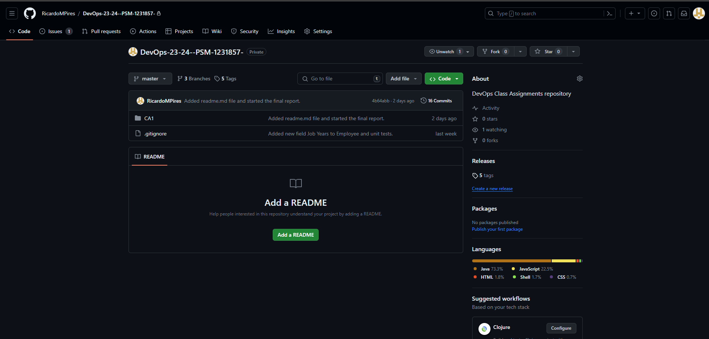
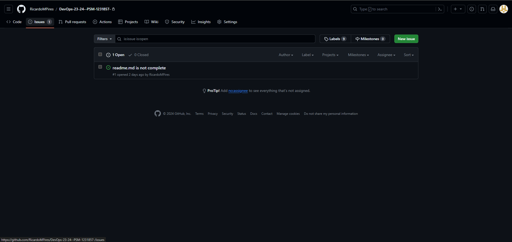

# Class Assignment 1

## Introduction

The goal of this class assignment was to use or personal repositories and use a basic gradle application to introduce new features. Although the features are simple, the goal is to understand how a gradle wrapper works and operates and to edit the build.gradle file.
The final result of the assignment can be found [here](https://github.com/RicardoMPires/DevOps-23-24--PSM-1231857-).

## Table of Contents

1. [Getting Started](#Getting-started)
2. [Implementing Changes](#Implementing-Changes)
    - [Part 1: Adding the runServer task](#Part-1-Adding-the-runServer-task)
    - [Part 2: Adding the test class and unit test](#Part-2-Adding-the-test-class-and-unit-test)
    - [Part 3: Adding the Copy task](#Part-3-Addding-the-Copy-task)
3. [Issues](#Issues)


## Getting Started

The first step is to clone [this repository](https://bitbucket.org/pssmatos/gradle_basic_demo/) to your local machine as it will serve as the basis for the task.
The rest of the assignment can be done by opening a bash terminal and running the following commands:

1. Navigate to the project directory (assuming the gradle application is already locally available):
   ```bash
   cd path/to/gradle_basic_demo
   ```
- command cd changes the current directory

2. Copy the application into a new CA2/Part1 folder:
   ```bash
   cp -r . ../CA2/Part1
   cd ../CA2/Part1
   ```
    - command cp copies the directories and files stated ('.', the current directory), the '-r' notation says it will be copied recursively (all its contents) and '../CA1' is the destination folder

3. Initialize the Git repository (if not already a Git repository, in that case this step can be ignored):
   ```bash
   git init
   ```
    - adds a ".git" directory to the current directory (the added directory contains all the information required for the repository work process)

4. Add all files to the staging area:
   ```bash
   git add .
   ```
    - before being ready to be commited and then pushed to the remote repository, changes must be added to a staging area, covered by this command. The "." notation indicates that ALL the unstaged files in the repository directory should be staged.

5. Commit the added files:
   ```bash
   git commit -m "Initial commit with the basic gradle application"
   ```
    - creates a new commit, containing the current contents of the index (the staged changes to the files in the repository) and the given log message (after "-m") describing the changes.

6. Push the commit to the remote repository:
   ```bash
   git push
   ```
    - This step  uploads local repository content to the remote repository location.


### Implementing Changes
#### Part 1: Adding the runServer task

For this first section, goal is to add a new task in the build.gradle file to start the server. The steps to do so are:

1. Open the build.gradle file (located in the root of the project) and navigate to the end of the file and add the new task:
   ```gradle
   task runServer(type:JavaExec, dependsOn: classes){
    group = "DevOps"
    description = "Launches a chat server that listens on localhost:59001"

    classpath = sourceSets.main.runtimeClasspath

    mainClass = 'basic_demo.ChatServerApp'

    args '59001'}

    ```

     - The task is of type JavaExec, which means it will execute a Java class. It depends on the classes task, which means it will only run after the classes task is completed. The group and description are used to describe the task. The classpath is set to the runtime classpath of the main source set. The mainClass is set to the ChatServerApp class, and the args are set to 59001, which is the port the server will listen to.


#### Part 2: Adding the test class and unit test

For this part of the assignment, a new test class will be created and a unit test will be added. The steps to do so are:

1. Create a new test folder and a new test class:
   ```bash
   mkdir -p src/test/java/basic_demo
   touch src/test/java/basic_demo/ChatServerAppTest.java
   ```
    - command mkdir creates a new directory, the '-p' notation allows for the creation of multiple directories at once, and the touch command creates a new file.


2. Setup the test class:
```java
package basic_demo;


import org.junit.Test;
import static org.junit.Assert.*;

public class AppTest {
}
```
3. Add the unit test:
```java
   @Test public void testAppHasAGreeting() {
      App classUnderTest = new App();
      assertNotNull("app should have a greeting", classUnderTest.getGreeting());
   }
```
4. Add the dependencies in the build.gradle file:
```gradle
dependencies {
    // Use Apache Log4J for logging
    implementation group: 'org.apache.logging.log4j', name: 'log4j-api', version: '2.11.2'
    implementation group: 'org.apache.logging.log4j', name: 'log4j-core', version: '2.11.2'
    testImplementation 'junit:junit:4.12'
}
```

5. Compile the project in the terminal(first navigate to the project folder):
```bash
./gradlew build
```
*Note*: It is also possible to run the task independently by using the command:
```bash
./gradlew runServer
```
6. Add and commit the changes(the -a command adds the files to the staging area):
```bash
git commit -a -m "Add test class and unit test"
```
7. Push the changes to the remote repository:
```bash
git push
```

#### Part 3: Adding the Copy task
The goal is to create a new task that will create a backup of the source of the application and copy it into a 'backup' folder in the application root. The steps to do so are:

1. Open the build.gradle file and add the new task:
```gradle
task copySources (type: Copy){
    group = "DevOps"
    description = "Copy source files to the target directory"

    from 'src/'
    into 'backup/'
}
```
5. Compile the project in the terminal(first navigate to the project folder):
```bash
./gradlew build
```
*Note*: It is also possible to run the task independently by using the command:
```bash
./gradlew copySources
```

6. Add and commit the changes(the -a command adds the files to the staging area):
```bash
git commit -a -m "Add copy task"
```
7. Push the changes to the remote repository:
```bash
git push
```

#### Part 3: Adding the Zip task
The goal is to create a new task that will create a .zip backup of the source of the application and copy it into a 'backup' folder in the application root. The steps to do so are:

1. Open the build.gradle file and add the new task:
```gradle
task zipSources (type: Zip){
    group = "DevOps"
    description = "Zip source files to the target directory"

    from 'src/'
    archiveFileName = 'src.zip'
    destinationDir = file('backup/')
}
```
5. Compile the project in the terminal(first navigate to the project folder):
```bash
./gradlew build
```
*Note*: It is also possible to run the task independently by using the command:
```bash
./gradlew zipSources
```
6. Add and commit the changes(the -a command adds the files to the staging area):
```bash
git commit -a -m "Add zip task"
```
7. Push the changes to the remote repository:
```bash
git push
```
8. Add a tag to mark the end of the first part of this assignment:
```bash
git tag ca2-part1
git push --tags
```

### Issues
During the development of the assignment, if any problems arose, is it possible to use the GitHub issues feature. Issues can be opened in the Github repository website. To open a new issue, follow these steps:

1. Go to the repository's main page:
   
2. Click on the "Issues" tab:
   
3. Click on the "New issue" button:
   
4. Fill in the issue title and description and click on the "Submit new issue" button:
   
5. The issue will be created and assigned a number and can be seen by anyone who has access to the repository:
   
6. The issue can be assigned to someone, labeled, and commented on. It can also be closed when the problem is solved by associating it with a commit:
```java
git commit -a -m "Fixes #1"
```
