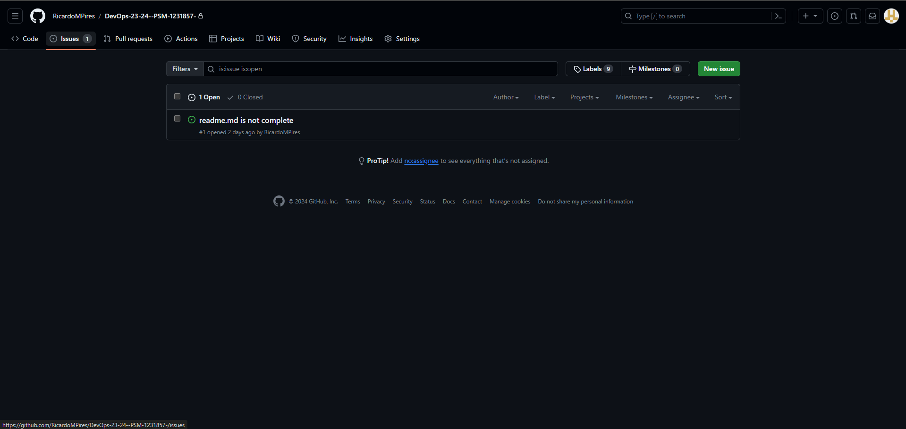

# Class Assignment 2

## Introduction

The goal of this class assignment was to use or personal repositories and adapt a basic maven application to use gradle
and introduce new features. Although the features are simple, the goal is to understand how a gradle wrapper works and
operates and to edit the build.gradle file.
The final result of the assignment can be found [here](https://github.com/RicardoMPires/DevOps-23-24--PSM-1231857-).

## Table of Contents

1. [Getting Started](#Getting-started)
2. [Implementing Changes](#Implementing-Changes)
   - [Part 1: Adding the frontend plugin](#Part-1-Adding-the-frontend-plugin)
   - [Part 2: Adding the copyJar task](#Part-2-Adding-the-copyJar-task)
   - [Part 3: Adding the deleteWebpackFiles task](#Part-3-Adding-the-deleteWebpackFiles-task)
   - [Part 4: Merging the branches](#Part-4-Merging-the-branches)
3. [Issues](#Issues)
4. [Alternative implementation solution](#Alternative-implementation-solution)
5. [Final Remarks](#Final-Remarks)


## Getting Started

The first step is to create a new branch called "tut-basic-gradle" in the repository to work on the assignment. To do
so, open a git bash and type in the command:

```bash
git branch tut-basic-gradle
```

After creating the branch, switch to it by typing:

```bash
git checkout tut-basic-gradle
```

1. Go to [this website](https://start.spring.io) to generate a new gradle spring boot project. Fill in the necessary
   information and add the needed dependencies according to the image below:
   

2. Click on the "Generate" button and download the project. Extract the files to the CA2 Part2 folder.

3. Open the project in IntelliJ and delete de **src** folder.

4. Copy the **src** folder from Class Assignment 1 Part 1 to the project folder.
5. Copy the **webpack.config.js** and the **package.json** files from Class Assignment 1 Part 1 to the project folder.
6. Delete the **src/main/resources/static/built/** folder.
7. In the **Employee.java** class, change all *javax.persistence* imports to *jakarta.persistence*.

## Implementing Changes

### Part 1: Adding the frontend plugin

For this first section, the goal is to add a frontend plugin to our gradle project. The steps to do so are:

1. Open the build.gradle file and add the plugin:

```gradle
 id "org.siouan.frontend-jdk17" version "8.0.0"
```

2. Configure the plugin in the same package.json file:

```gradle
 frontend {
nodeVersion = "16.20.2"
assembleScript = "run build"
cleanScript = "run clean"
checkScript = "run check"
}
```

3. Add the dependencies in the package.json file:

```gradle
"scripts": {
"webpack": "webpack",
"build": "npm run webpack",
"check": "echo Checking frontend",
"clean": "echo Cleaning frontend",
"lint": "echo Linting frontend",
"test": "echo Testing frontend"
},
```

4. Add the package manager to the package.json file, before the scripts section:

```gradle
"packageManager": "npm@9.6.7",
```

5. Compile the project in the terminal(first navigate to the project folder):

```bash
./gradlew build
```

6. Start the project with the following command:

```bash
./gradlew bootRun
```

7. Access the following [url](localhost:8080) in your browser to check the result. It should look something like this:
   

### Part 2: Adding the copyJar task

For this part of the assignment, a new task will be added to copy the generated Jar file to a **dist** folder in the
project root. The steps to do so are:

1. Open the build.gradle file and add the task:
```gradle
task copyJar(type: Copy, dependsOn: build) {
	from 'build/libs/'
	into 'dist'
	include '*.jar'
}
```

2. Compile the project in the terminal(first navigate to the project folder):
```bash
./gradlew build
```

3. Add all te files to the staging area:
```bash
git add .
```

4. Commit the changes:
```bash
git commit -m "Added the copyJar task"
```

5. Push the changes to the repository:
```bash
git push
```

### Part 3: Adding the deleteWebpackFiles task

For this part of the assignment, a new task will be added to delete the files generated by the webpack. The steps to do
so are:

1. Open the build.gradle file and add the task:
```gradle
task deleteWebpackFiles(type: Delete) {
	delete 'src/main/resources/static/built'
}
```

2. Add the following command to make sure this task is executed automatically by the task *clean*:

```gradle
clean.dependsOn(deleteWebpackFiles)
```

3. Compile the project in the terminal(first navigate to the project folder):
```bash
./gradlew build
```

4. Add all te files to the staging area:
```bash
git add .
```

5. Commit the changes:
```bash
git commit -m "Added the deleteWebpackFiles task"
```

6. Push the changes to the repository:
```bash
git push
```

### Part 4: Merging the branches

Now we need to merge to the master branch. To do so, follow these steps:

1. Switch to the master branch:
```bash
git checkout master
```

2. Merge the tut-basic-gradle branch:
```bash
git merge --no-ff tut-basic-gradle
```

3. Push the changes to the repository:
```bash
git push
```

## Issues
During the development of the assignment, if any problems arose, is it possible to use the GitHub issues feature. Issues can be opened in the Github repository website. To open a new issue, follow these steps:

1. Go to the repository's main page:
   
2. Click on the "Issues" tab:
   
3. Click on the "New issue" button:
   
4. Fill in the issue title and description and click on the "Submit new issue" button:
   
5. The issue will be created and assigned a number and can be seen by anyone who has access to the repository:
   
6. The issue can be assigned to someone, labeled, and commented on. It can also be closed when the problem is solved by associating it with a commit:
```java
git commit -a -m "Fixes #1"
```

## Alternative implementation solution

An alternative solution to the assignment would be to use a different solution for the build automation tool. Instead of
using Gradle, we could use Maven. Maven is a build automation tool used primarily for Java projects. It is similar to
Gradle but uses an XML file to define the project's structure and dependencies. The steps to implement the changes using
Maven would be:

1. Create a new module in your project and copy the **src** folder from Class Assignment 2 Part 2 to the project folder.
2. Copy the **webpack.config.js** and the **package.json** files from Class Assignment 2 Part 2 to the project folder.
3. Add the pom.xml file to the project (containing the frontend plugin and both the tasks):

```xml
<?xml version="1.0" encoding="UTF-8"?>
<project xmlns="http://maven.apache.org/POM/4.0.0"
         xmlns:xsi="http://www.w3.org/2001/XMLSchema-instance"
         xsi:schemaLocation="http://maven.apache.org/POM/4.0.0 https://maven.apache.org/xsd/maven-4.0.0.xsd">
   <modelVersion>4.0.0</modelVersion>

   <parent>
      <groupId>org.springframework.boot</groupId>
      <artifactId>spring-boot-starter-parent</artifactId>
      <version>2.2.4.RELEASE</version>
      <relativePath/>
   </parent>

   <groupId>com.greglturnquist</groupId>
   <artifactId>react-and-spring-data-rest-basic</artifactId>
   <version>0.0.1-SNAPSHOT</version>

   <name>React.js and Spring Data REST</name>
   <description>An SPA with ReactJS in the frontend and Spring Data REST in the backend</description>

   <properties>
      <project.build.sourceEncoding>UTF-8</project.build.sourceEncoding>
      <java.version>1.8</java.version>
   </properties>

   <dependencies>
      <dependency>
         <groupId>org.springframework.boot</groupId>
         <artifactId>spring-boot-starter-thymeleaf</artifactId>
      </dependency>
      <dependency>
         <groupId>org.springframework.boot</groupId>
         <artifactId>spring-boot-starter-data-jpa</artifactId>
      </dependency>
      <dependency>
         <groupId>org.springframework.boot</groupId>
         <artifactId>spring-boot-starter-data-rest</artifactId>
      </dependency>
      <dependency>
         <groupId>org.springframework.boot</groupId>
         <artifactId>spring-boot-devtools</artifactId>
      </dependency>
      <dependency>
         <groupId>com.h2database</groupId>
         <artifactId>h2</artifactId>
         <scope>runtime</scope>
      </dependency>
      <dependency>
         <groupId>org.springframework.boot</groupId>
         <artifactId>spring-boot-starter-test</artifactId>
         <scope>test</scope>
      </dependency>
   </dependencies>

   <build>
      <plugins>
         <plugin>
            <groupId>com.github.eirslett</groupId>
            <artifactId>frontend-maven-plugin</artifactId>
            <version>1.9.1</version>
            <configuration>
               <installDirectory>target</installDirectory>
            </configuration>
            <executions>
               <execution>
                  <id>install node and npm</id>
                  <goals>
                     <goal>install-node-and-npm</goal>
                  </goals>
                  <configuration>
                     <nodeVersion>v12.14.0</nodeVersion>
                     <npmVersion>6.13.4</npmVersion>
                  </configuration>
               </execution>
               <execution>
                  <id>npm install</id>
                  <goals>
                     <goal>npm</goal>
                  </goals>
                  <configuration>
                     <arguments>install</arguments>
                  </configuration>
               </execution>
               <execution>
                  <id>webpack build</id>
                  <goals>
                     <goal>webpack</goal>
                  </goals>
               </execution>
            </executions>
         </plugin>

         <plugin>
            <groupId>org.springframework.boot</groupId>
            <artifactId>spring-boot-maven-plugin</artifactId>
         </plugin>

         <plugin>
            <artifactId>maven-clean-plugin</artifactId>
            <version>3.1.0</version>
            <configuration>
               <filesets>
                  <fileset>
                     <directory>${project.basedir}/src/main/resources/static/built</directory>
                     <includes>
                        <include>**/*</include>
                     </includes>
                  </fileset>
               </filesets>
            </configuration>
         </plugin>

         <plugin>
            <groupId>org.apache.maven.plugins</groupId>
            <artifactId>maven-resources-plugin</artifactId>
            <version>3.2.0</version>
            <executions>
               <execution>
                  <id>copy-jar</id>
                  <phase>package</phase>
                  <goals>
                     <goal>copy-resources</goal>
                  </goals>
                  <configuration>
                     <outputDirectory>${project.basedir}/dist</outputDirectory>
                     <resources>
                        <resource>
                           <directory>${project.build.directory}</directory>
                           <includes>
                              <include>*.jar</include>
                           </includes>
                        </resource>
                     </resources>
                  </configuration>
               </execution>
            </executions>
         </plugin>
      </plugins>
   </build>
</project>
```

5. Compile the project by using the following command:

```bash
mvn build
```

6. Navigate to the created folder and start the project with the following command:

```bash
mvn spring-boot:run
```

7. Access the following [url](localhost:8080) in your browser to check the result. It should look similar to the Gradle
   version.

8. Add all the files to the staging area by using the following command:

```bash
git add .
```

9. Commit the changes by using the following command:

```bash
git commit -m "Added the Maven build automation tool"
```

10. Push the changes to the repository by using the following command:

```bash
git push
```

By following these steps, the assignment can be completed using Maven as the build automation tool instead of Gradle.
This alternative solution provides a different approach to implementing the changes required for the assignment and
demonstrates the flexibility of using different build automation tools for Java projects.

## Final Remarks

During the development of this assignment some issues arose with the implementation of the frontend plugin. The plugin
was not working as expected and the project was not compiling correctly. After some troubleshooting, the issue was
resolved by adding the package manager section to the build.gradle file. Unfortunately, due to attempting to build the
project before adding the package manager, some files were generated and added that were preventing the project from
compiling. This meant that the assignment had to be restarted, hence the extra commits to the project.
After redoing the steps and adding the package manager section, the project compiled correctly and the frontend plugin
was working as expected. The copyJar and deleteWebpackFiles tasks were added successfully and the project was merged to
the master branch. The assignment was completed successfully and the changes were pushed to the repository.


