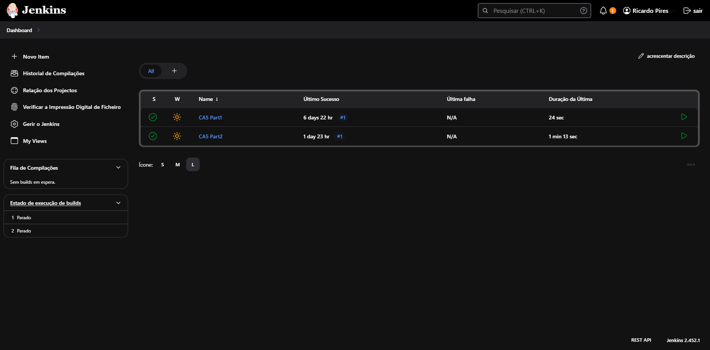

# Class Assignment 5

## Introduction

The goal of this class assignment was to use create a pipeline with Jenkins that builds and pushes the images to Docker.
Before that, a similar, simpler pipeline was created for practice. Both pipelines had similar tasks like Checkout,
Assemble, Test and Build but the second one also pushed the Docker image to Dockerhub.
The final result of the assignment can be found [here](https://github.com/RicardoMPires/DevOps-23-24--PSM-1231857-).

## Table of Contents

- [Getting started](#getting-started)
- [First Jenkinsfile](#first-jenkinsfile)
- [Second Jenkinsfile](#second-jenkinsfile)
- [Dockerfile](#dockerfile)
- [Jenkins Dashboard](#jenkins-dashboard)
- [Final remarks](#final-remarks)

## Getting started

The first step to complete this assignment is to install Jenkins. To do this, we need to these steps:

1. Download the Jenkins war file from the [Jenkins website](https://www.jenkins.io/download/)(at this time the latest
   version is 2.462).
2. Open a terminal in the same directory where the war file is present and run the following command:

```bash
java -jar jenkins.war
```

3. After that we can access Jenkins by opening a browser and going to the following URL:

http://localhost:8080

4. To complete the assignment, we need to install the HTML Publisher plugin in Jenkins. To do this, we need to go to
   Manage Jenkins -> Plugins -> Available and search for HTML Publisher.

Jenkins is now running and we can start creating the pipeline. To do this we can follow the pdf provided by the teacher.

## First Jenkinsfile

After setting up the job and inserting the Github link to the repository, we can start creating the Jenkinsfile. The
Jenkinsfile is responsible for defining the pipeline and the steps that the pipeline will execute. The Jenkinsfile for
the first pipeline is shown below:

```groovy
pipeline {
    agent any

    stages {
        stage('Checkout') {
            steps {
                git 'https://github.com/RicardoMPires/DevOps-23-24--PSM-1231857-.git'
            }
        }

        stage('Assemble') {
            steps {
                dir('CA2/Part1/gradle_basic_demo') {
                    sh './gradlew assemble'
                }
            }
        }

        stage('Test') {
            steps {
                dir('CA2/Part1/gradle_basic_demo') {
                    sh './gradlew test'
                }
            }
            post {
                always {
                    junit '**/build/test-results/**/*.xml'
                }
            }
        }

        stage('Archive') {
            steps {
                archiveArtifacts artifacts: '**/build/libs/*.jar', fingerprint: true
            }
        }
    }
}
```

*Note:* Since in this repository the Jenkinsfile is localated in /CA5/Part1 and the gradle project is in
/CA2/Part1/gradle_basic_demo, we need to specify the Script path in the Jenkins job configuration, which is this case is
CA5/Part1/Jenkinsfile.

After creating the pipeline, we can run it and check if it is working correctly. If everything is working correctly, we
can move on to the second pipeline.

## Second Jenkinsfile

The second Jenkinsfile is similar to the first one, but it has an extra stage that pushes the Docker image to Dockerhub.
The Jenkinsfile for the second pipeline is shown below:

```groovy
pipeline {
    agent any

    stages {
        stage('Checkout') {
            steps {
                git 'https://github.com/RicardoMPires/DevOps-23-24--PSM-1231857-.git'
            }
        }

        stage('Assemble') {
            steps {
                dir('CA2/Part2/react-and-spring-data-rest-basic') {
                    bat './gradlew assemble'
                }
            }
        }

        stage('Test') {
            steps {
                dir('CA2/Part2/react-and-spring-data-rest-basic') {
                    bat './gradlew test'
                }
            }
            post {
                always {
                    junit '**/build/test-results/**/*.xml'
                }
            }
        }

        stage('Javadoc') {
            steps {
                dir('CA2/Part2/react-and-spring-data-rest-basic') {
                    bat './gradlew javadoc'
                }
            }
            post {
                always {
                    publishHTML(target: [
                            allowMissing         : false,
                            alwaysLinkToLastBuild: false,
                            keepAll              : true,
                            reportDir            : 'CA2/Part2/react-and-spring-data-rest-basic/build/docs/javadoc',
                            reportFiles          : 'index.html',
                            reportName           : 'Javadoc'
                    ])
                }
            }
        }

        stage('Archive') {
            steps {
                archiveArtifacts artifacts: '**/build/libs/*.war', fingerprint: true
            }
        }

        stage('Publish Image') {
            steps {
                script {
                    dir('CA5/Part2') {
                        bat 'copy ..\\..\\CA2\\Part2\\react-and-spring-data-rest-basic\\build\\libs\\*.war .'
                        def app = docker.build("ricardompires/devops_23_24:CA5-Part2")
                        docker.withRegistry('https://registry.hub.docker.com', 'dockerhub_credentials') {
                            app.push()
                        }
                    }
                }
            }
        }
    }
}
```

*Note:* Since in this repository the Jenkinsfile is located in /CA5/Part2 and the gradle project is in
/CA2/Part2/react-and-spring-data-rest-basic, we need to specify the Script path in the Jenkins job configuration, which
is this case is CA5/Part2/Jenkinsfile.

Notice in this Jenkinsfile, the Docker image is pushed to Dockerhub. To do this, we need to add the Dockerhub
credentials in Jenkins. When setting up the pipeline there is an option to add a credential, in which we input our
username and password and name the credentials(in this case they were named dockerhub_credentials).
After building, the image will be uploaded to the Dockerhub repository with the tag CA5-Part2

## Dockerfile

Since the second Jenkinsfile pushes the Docker image to Dockerhub, we need to create a Dockerfile in the project,
running a Tomcat image, to be able to run the .war file. The Dockerfile is shown below:

```dockerfile
# Start from a base image with Tomcat installed
FROM tomcat:9.0-jdk17-openjdk-slim

# Remove the default Tomcat webapps
RUN rm -rf /usr/local/tomcat/webapps/*

# Copy the WAR file into the Docker image
COPY ./*.war /usr/local/tomcat/webapps/

# Expose the necessary port for the application
EXPOSE 8080
```

## Jenkins Dashboard

If both builds are suscessful, the Jenkins dashboard should look like this:


## Final remarks

In conclusion, this report detailed the process of setting up Jenkins pipelines for a project that uses a variety of
technologies including Java, JavaScript, Spring Boot, Maven, NPM, React, Gradle, and Ruby. The pipelines were designed
to automate several stages of the development process, including code checkout, assembly, testing, archiving of
artifacts, and publishing of Docker images.

The first pipeline was a simpler version, created for practice, which performed the basic tasks of checkout, assembly,
testing, and archiving. The second pipeline, which was more complex, added the stages of generating Javadoc and
publishing a Docker image to DockerHub.

During the process, several challenges were encountered, particularly related to the differences between Unix-like and
Windows operating systems. These challenges were addressed by modifying the Jenkinsfile to use commands compatible with
the Windows environment.

The report also highlighted the importance of using the correct commands and environment variables for the specific
operating system on which Jenkins is running. It demonstrated how to troubleshoot common errors and provided solutions
to ensure the successful execution of the Jenkins pipelines.

Overall, the successful setup of these Jenkins pipelines represents a significant step towards automating and
streamlining the development process, thereby improving productivity and efficiency.